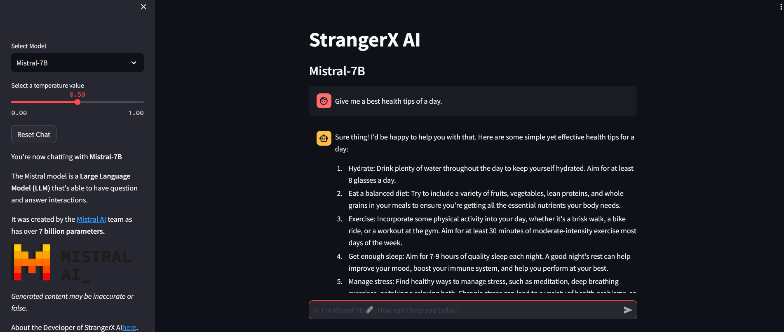

ℹ️Recommended to Deploy inside Huggingface Workspaces

🚀Check out the configuration reference at https://huggingface.co/docs/hub/spaces-config-reference

🚀Huggingface Space https://huggingface.co/spaces/prithivMLmods/StrangerX-AI-Bot

🚀Repository https://huggingface.co/spaces/prithivMLmods/StrangerX-AI-Bot/tree/main

ℹ️Generated Result in Huggingface Spaces:

🗞️Mistral 7B & 2B for the Day 2 Day Problem ( HealthTips, Small Logical Problems, Auto-Generative Context ) 

🔮Prompt : " Give me a best tip of a day "

ℹ️Generated Result in Huggingface Spaces:

🗞️Microsoft Phi3 ( High Complex Problem, More Parameters, Code-Generation Context )

🔮Prompt : " Give me a code for B+ tree random number Sequences "

.

.

.

